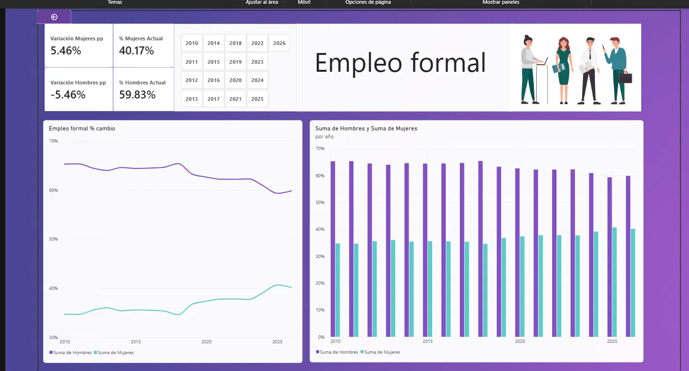

# Análisis del Empleo Formal en Costa Rica (2010-2026)

Dashboard interactivo en Power BI que analiza la evolución de la participación de hombres y mujeres en el empleo formal en Costa Rica, usando datos oficiales del INEC.

## Objetivo
Identificar cómo ha cambiado la brecha de participación entre hombres y mujeres en el empleo formal a lo largo del tiempo, y visualizar la tendencia año a año.

## Fuente de datos
Instituto Nacional de Estadística y Censos (INEC) de Costa Rica.

## Herramientas utilizadas
- **Power Query**: limpieza y transformación de los datos
- **Power Pivot**: modelado de datos
- **DAX**: medidas calculadas (CALCULATE, SUM) para obtener valores por año y variaciones
- **Power BI Desktop**: visualización e interactividad del dashboard

## Proceso
1. Importación y limpieza de los datos históricos de empleo formal por sexo.
2. Corrección de tipos de datos (la columna año estaba como texto y se convirtió a número entero).
3. Creación de medidas DAX para calcular el porcentaje actual y la variación en puntos porcentuales desde 2010 hasta el año más reciente.
4. Diseño de tarjetas KPI, gráfico de líneas (tendencia) y gráfico de barras (comparación año a año).

## Hallazgos principales
- La participación de los hombres en el empleo formal bajó de 65.29% (2010) a 59.83% (año más reciente), una variación de **-5.46 puntos porcentuales**.
- La participación de las mujeres subió de 34.71% (2010) a 40.17%, una variación de **+5.46 puntos porcentuales**.
- La brecha entre hombres y mujeres se ha reducido de forma sostenida durante el período analizado.
